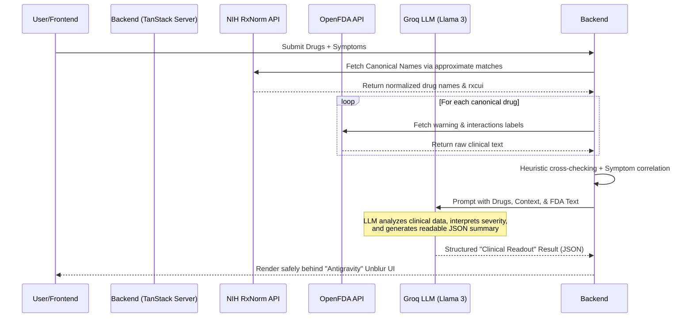

# Chrono-Med Check 🌌💊

**Chrono-Med Check** is a high-fidelity 3D visualization engine for the Chrono-Med Discovery application. It relies on a futuristic "Antigravity" conceptual interface paired with an advanced AI layer to seamlessly analyze and visualize complex drug interactions.

---

## 🚀 Live Demo

**Access the fully deployed application here:** [https://druginteraction.rohithsd0222.workers.dev/](https://druginteraction.rohithsd0222.workers.dev/)

---

## 🎯 Problem Statement

Healthcare professionals and patients often struggle to quickly and accurately determine potential drug interactions when combining multiple medications. The sheer complexity of pharmacological data makes it difficult to understand the severity and mechanisms of these interactions, which can lead to adverse drug events.

Traditional drug interaction checkers provide dense, text-heavy outputs that are difficult to scan. They lack an intuitive, engaging interface to help users conceptualize overlapping medication effects, assess the immediate risks, and seamlessly generate portable reports for clinical records or personal tracking.

## 💡 Solution

Chrono-Med Check solves this by offering a premium, futuristic 3D visual interface (powered by React Three Fiber) to interpret drug interactions. By securely passing medication inputs through advanced AI models (via Groq), it produces a structured, visually engaging clinical readout.

**Key Features:**

- **Antigravity 3D Engine**: Immersive, dynamic 3D visualizations for an unparalleled user experience.
- **AI-Powered Drug Analysis**: Connects with Groq LLM APIs to generate accurate, detailed, and clinical-grade drug interaction reports.
- **Hover-to-Unblur Interface**: A sleek UI element that unblurs clinical data on hover, preventing shoulder-surfing while adding interactive depth.
- **PDF Report Generation**: Users can instantly export their interaction analysis into a clean, downloadable PDF format.
- **Persistent Local History**: Maintains an archive of past analyses right in the dashboard for quick referencing, without requiring complex database setups for the client.

## 🛠️ Technology Stack

- **Frontend Framework**: React 19, TypeScript, Vite
- **Routing**: TanStack Router (`@tanstack/react-router`)
- **Styling**: Tailwind CSS v4, Radix UI components
- **3D Visualization**: Three.js, React Three Fiber
- **Form Handling & Validation**: React Hook Form, Zod
- **AI / LLM Integration**: Groq API
- **PDF Generation**: `jspdf`, `jspdf-autotable`

## 🚀 Getting Started

### Prerequisites

- Node.js (v18 or higher recommended)
- `npm`, `yarn`, `pnpm`, or `bun`

### Installation

1. **Clone the repository:**

   ```bash
   git clone https://github.com/Rohith0750/ROLL-COMMIT-SHIP.git
   cd chrono-med-check
   ```

2. **Install dependencies:**

   ```bash
   npm install
   ```

3. **Set up Environment Variables:**
   Create a `.env` file in the root directory and add securely your Groq API Key (and any other necessary variables):

   ```env
   VITE_GROQ_API_KEY=your_groq_api_key_here
   VITE_OCR_SPACE_API_KEY=your_ocr_space_api_key_here
   ```

   _(Note: Never commit your `.env` file!)_

4. **Run the Development Server:**
   ```bash
   npm run dev
   ```
   The application will be available at `http://localhost:5173`.

## 🌍 Deployment (Cloudflare Workers)

This application is built as a full-stack **TanStack Start** app leveraging the `@cloudflare/vite-plugin`. This means it generates a `.wrangler` worker configuration and requires a Cloudflare environment to run perfectly (standard Node.js environments like Render are not suitable).

To deploy your own version:

1. Log into your Cloudflare dashboard and navigate to **Workers & Pages**.
2. Click **Create application** -> **Deploy your Worker Project** and connect your GitHub repository.
3. Configure the build settings as follows:
   - **Build command:** `npm run build`
   - **Deploy command:** `npx wrangler deploy`
4. Add your **Environment Variables** (`VITE_GROQ_API_KEY`, etc.) directly into the Cloudflare UI to securely power the AI features.

## 📂 Project Structure Overview

```text
chrono-med-check/
├── public/                 # Static assets (favicons, etc.)
├── src/                    # Source code
│   ├── assets/             # Images and design assets
│   ├── components/         # Reusable React components
│   │   ├── ui/             # Shadcn/Radix atomic UI components
│   │   └── Antigravity.tsx # Complex 3D Visualization Engine
│   ├── routes/             # TanStack Router page definitions
│   │   ├── __root.tsx      # Root layout
│   │   ├── index.tsx       # Landing page
│   │   ├── auth.tsx        # Authentication flow
│   │   ├── dashboard.tsx   # Primary user interface
│   │   ├── analysis.tsx    # Result & 3D report view
│   │   └── history.tsx     # Past analyses local tracker
│   ├── server/             # Server-side functions / APIs
│   │   └── drug-analysis.ts# Heuristic + AI (Groq) Logic
│   ├── lib/                # Utility functions & helpers
│   ├── index.css           # Global Tailwind typography/variables
│   └── routeTree.gen.ts    # Auto-generated routing tree
├── .env                    # Environment variables (Not committed)
├── .gitignore              # Git ignore configuration
├── package.json            # Node.js dependencies & scripts
├── tailwind.config.ts      # Tailwind CSS configuration
├── tsconfig.json           # TypeScript compilation settings
└── vite.config.ts          # Vite bundler configuration
```

## ⚙️ Backend Flow & AI Processing

Chrono-Med Check's backend handles data extraction, authoritative knowledge retrieval, and LLM-powered summarization all within a single unified flow. Here is the detailed step-by-step breakdown:

1. **Input Reception**: The server accepts a list of queried drugs (`compounds`) and the user's reported symptom/problem.
2. **Drug Normalization (RxNorm API)**: To handle typos and diverse brand names, every compound is sent to the NIH's RxNorm API to be matched and resolved into a canonical/generic name and corresponding `rxcui` identifier.
3. **Data Retrieval (OpenFDA API)**: For every canonically identified drug, the backend calls the OpenFDA API to retrieve comprehensive clinical label data—specifically scanning for "contraindications", "warnings", and the raw "drug_interactions" text.
4. **Heuristic Cross-Checking**: The backend parses the FDA data, cross-referencing every queried drug against the interaction texts of the other drugs present in the query. It highlights potential interactions and does initial heuristic risk analysis.
5. **AI Synthesis (Groq LLM)**:
   - All retrieved OpenFDA text, normalized drug lists, and user symptoms are packaged into a structured prompt.
   - Sent to the **llama-3.3-70b-versatile** model via the Groq API.
   - The LLM parses the dense clinical language to interpret true risks, assigns severity (`high`, `medium`, `low`), and generates a short, structured "Clinical Readout" JSON response.
6. **Delivery**: The synthesized findings (or heuristic fallbacks if the LLM errors) are sent back to the frontend to be rendered in the Antigravity 3D interface.

### Flow Diagram



## 📝 License

This project is intended for demonstration, educational, and medical technology exploration. Please refer to the repository's main branch for any explicit licensing conditions.
